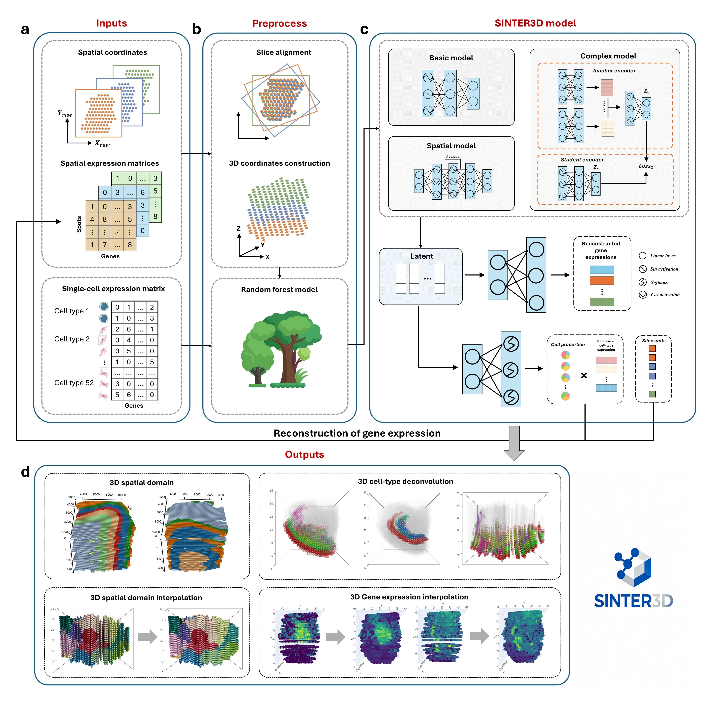

# SINTER3D

### SINTER3D is the first implicit neural representation-based framework for joint whole-transcriptome 3D interpolation. 




SINTER3D learns the coordinated spatial distribution patterns of all genes within a unified framework, thereby supporting gene expression queries at arbitrary 3D coordinates. Furthermore, the framework enables joint 3D spatial domain identification for multi-section data and facilitates cell type deconvolution for low-resolution spatial transcriptomics data when integrated with single-cell reference data. The core innovation of SINTER3D lies in leveraging the implicit neural representation framework to learn a continuous mapping from spatial coordinates to gene expression, accurately capturing cross-section gene expression evolution and spatial structural variation patterns.


## Installation
```
conda create -n SINTER3D_env python=3.8.19
``` 
```
conda activate SINTER3D_env
``` 
```
cd SINTER3D-master
``` 
```
pip install -r requirements.txt
``` 

## Tutorials
We provided comprehensive tutorials for using SINTER3D.Please click on different tutorials to obtain more details.
#### [tutorial 1](SINTER3D-master/demo_mouse_brain_3D.ipynb)
#### [tutorial 2](SINTER3D-master/demo_DLPFC_73-76.ipynb)
#### [tutorial 3](SINTER3D-master/demo_Drosophila.ipynb)
#### [tutorial 4](SINTER3D-master/demo_human_heart_3d.ipynb)
#### [tutorial 5](SINTER3D-master/demo_her2_breast_cancer.ipynb)


## Data availability
The spatial transcriptomics mouse brain data are publicly available at https://www.ncbi.nlm.nih.gov/geo/query/acc.cgi?acc=GSE147747. The mouse brain dataset profiled by 10x Genomics Chromium platform is available at https://www.ebi.ac.uk/biostudies/arrayexpress/studies/E-MTAB-11115.

The spatial transcriptomics DLPFC data are publicly available at https://github.com/LieberInstitute/spatialLIBD. The DLPFC dataset profiled by 10x Genomics Chromium platform is available at https://www.ncbi.nlm.nih.gov/geo/query/acc.cgi?acc=GSE144136.

The Drosophila embryo Stereo-seq dataset is publicly available at (https://db.cngb.org/stomics/flysta3d/download.html. The Drosophila embryo sci-RNA-seq dataset is publicly available at https://www.ncbi.nlm.nih.gov/geo/query/acc.cgi?acc=GSE190149.

The spatial transcriptomics data are available from https://data.mendeley.com/datasets/dgnysc3zn5/1. The human embryonic heart dataset profiled by 10x Genomics Chromium platform is available at https://data.mendeley.com/datasets/mbvhhf8m62/2.

The spatial transcriptomics data are publicly available at https://zenodo.org/record/4751624. The breast cancer dataset profiled by 10x Genomics Chromium platform is available at https://www.ncbi.nlm.nih.gov/geo/query/acc.cgi?acc=GSE176078.
